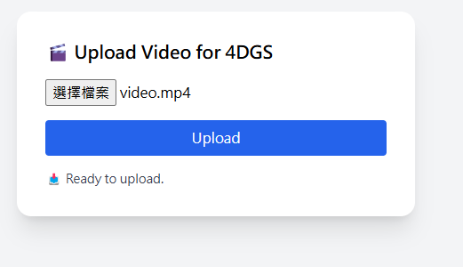
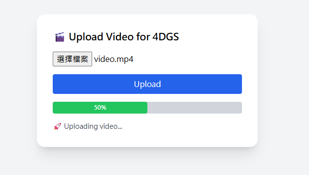
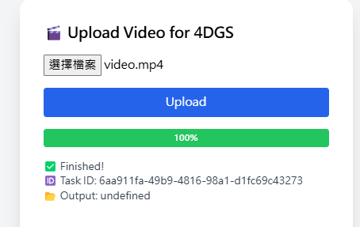
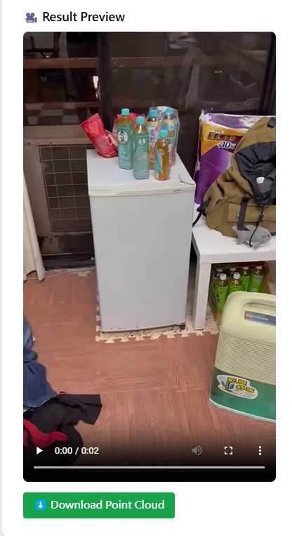

# 4D Gaussian Splatting Web System

A full-stack web system to automate 4D Gaussian Splatting (4DGS) reconstruction and rendering from a single or multiple video uploads.

---

## Features

- Upload video(s) via web interface
- Automatically extract frames using ffmpeg
- Run COLMAP (SfM + MVS) for camera pose estimation and dense reconstruction
- Convert COLMAP results into NeRF Studio data format (`ns-process-data`)
- Train real-time 4D Gaussian Splatting models (`train.py`)
- Render output videos (`render.py`)
- Download point cloud files (`.pth`, `.ply`)
- Easy-to-use frontend with progress visualization and result preview

---

## Project Structure

```
├── backend/
│   ├── main.py          # FastAPI server
│   ├── utils.py         # File save helpers
│   ├── video_utils.py   # Frame extraction (ffmpeg)
│   ├── colmap_utils.py  # COLMAP + ns-process + training + rendering
│   ├── 4dgs_utils.py    # (Optional) Future expansion for 4DGS tools
│   └── requirements.txt # Backend dependencies
├── frontend/
│   ├── src/
│   │   ├── App.jsx      # Main frontend upload page
│   │   └── ...
│   ├── public/
│   ├── vite.config.js
│   ├── tailwind.config.js
│   └── package.json     # Frontend dependencies
└── 4DGaussians/          # Your 4DGS original repo (train.py, render.py, etc.)
```

---

##  Backend Setup (FastAPI)

### Install dependencies
(Assuming you already activated your 4DGaussians environment)

```bash
pip install fastapi uvicorn python-multipart aiofiles
```
### Start backend server

```bash
uvicorn main:app --host 0.0.0.0 --port 8000
```

---

## Frontend Setup (React + TailwindCSS)
### Install dependencies

```bash
npm install
```
### Start frontend

```bash
npm run dev
```
### Frontend Features

-  Video file upload  
-  Real-time progress bar  
-  Stage status updates  
  (uploading → frame extraction → COLMAP → training → rendering)  
-  Rendered video preview  
-  One-click download for point cloud data

---

## System Workflow
```
Upload Video
    ↓
Extract Frames (ffmpeg)
    ↓
Camera Pose Estimation & Dense Reconstruction (COLMAP)
    ↓
Data Conversion (ns-process-data)
    ↓
4D Gaussian Splatting Training (train.py)
    ↓
Rendering (render.py)
    ↓
Result Video Preview + Point Cloud Download
```

---

## Demo (Website Preview)

- Before Upload 
  
  
- Uploading (Progress)
    

- Upload Completed
  
  
- Video Preview & Point Cloud Download 
  
 
---

## License
This project is for research and educational purposes.
